<!DOCTYPE html>
<html>
<head>
    <meta charset="UTF-8">
    <title>tg-flow 使用手册</title>
    
</head>
<body>
<header>
    <h1>tg-flow 使用手册</h1>
</header>
<main>
    <h2>1. 编写目的</h2>
    
通过对本公司的 tg-flow 软件产品操作过程的描述，使用户可以自主对软件进行使用和操作。

    <h2>2. 下载与安装</h2>

    <h3>2.1 下载安装包</h3>
    
git clone https://github.com/didi/tg-flow

    <h3>2.2 安装和启动</h3>

    <h4>tg-service 的安装和启动：</h4>
    <ol>
        <li>将 tg-service 软件包拷贝到要安装的目录；</li>
        <li>进入 tg-service 目录，执行 <code>./build.sh</code>，会生成 output 文件夹；</li>
        <li>执行：<code>cd output</code> 进入 output 目录，执行：<code>nohup ./control.sh start > nohup.log 2>&1 &</code>，启动服务。</li>
    </ol>

    <h4>tg-web 的安装步骤：</h4>
    <ol>
        <li>将 tg-web 软件包拷贝到要安装的目录；</li>
        <li>通过命令行方式，进入到 tg-web 所在目录，执行如下命令：<code>npm install</code>，即可完成 tg-web 部分的安装；</li>
        <li>通过命令行方式，进入到 tg-web 所在目录，执行如下命令：<code>npm start</code>，即可完成 tg-web 的启动；</li>
        <li>打开浏览器地址栏，输入 <a href="http://localhost:8888/">http://localhost:8888/</a>，可以打开登录页，说明安装成功。</li>
    </ol>

    <h4>3. tg-core 是应用系统使用时需要导入的组件，不需要单独安装。</h4>

    <h2>3. 登录</h2>

    <h3>3.1 账号分配</h3>
    
初次安装时，系统会默认生成一个管理员账号 admin，密码 admin，可以使用该账号进行后续的登录和分配其他子账号。

    <h3>3.2 登录系统</h3>
    
第一次打开系统的时候，系统会自动跳转至登录页面，这个时候可以使用管理员账号或者子管理员账号，输入账号、密码、验证码进行登录。

    

        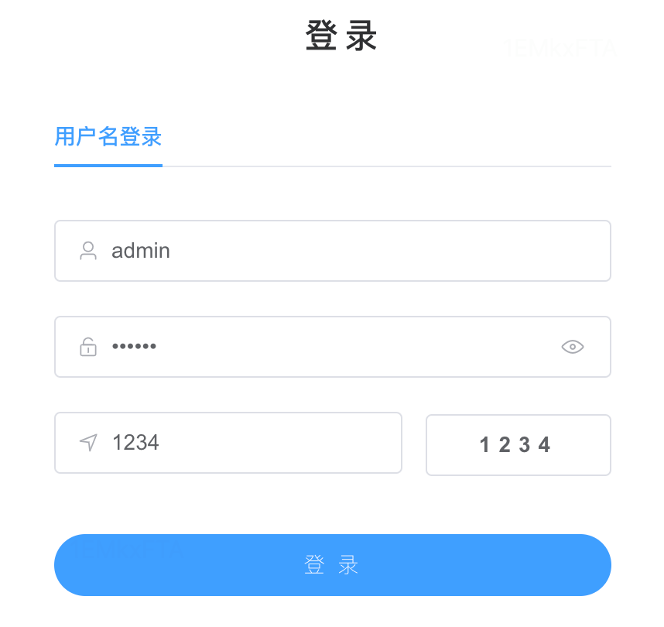
    

    <h3>3.3 注销登录</h3>
    
进入系统后，可以通过点击系统的右上角“退出登录”按钮注销登录。

    <h2>4. 系统管理</h2>
    
tg-flow 支持同时接入并管理多个系统和应用，每个系统都有独立的系统ID和系统名称，通过系统管理页面可以查看当前接入的所有业务系统。

    

        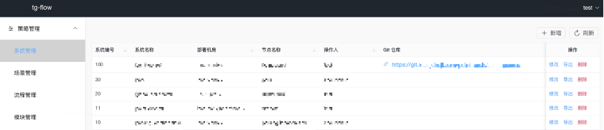
    

    <h3>图4.1 系统管理界面</h3>
    <table>
        <tr>
            <th>属性名称</th>
            <th>描述</th>
        </tr>
        <tr>
            <td>id</td>
            <td>系统 ID</td>
        </tr>
        <tr>
            <td>app_name</td>
            <td>系统名称</td>
        </tr>
        <tr>
            <td>machine_room</td>
            <td>系统所部署的集群</td>
        </tr>
        <tr>
            <td>node_name</td>
            <td>系统所在机房</td>
        </tr>
        <tr>
            <td>operator</td>
            <td>系统创建和修改人员</td>
        </tr>
        <tr>
            <td>create_time</td>
            <td>系统创建时间</td>
        </tr>
        <tr>
            <td>update_time</td>
            <td>系统更新时间</td>
        </tr>
        <tr>
            <td>git_url</td>
            <td>系统代码所属的代码仓库地址</td>
        </tr>
    </table>

    
在策略管理 -> 系统管理页面可以进行新增，修改，导出和删除系统等相关操作。

    

        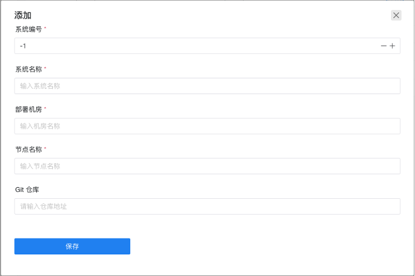
    

    <h3>图4.2 新增系统对话框</h3>
    
其中系统编号，系统名称，部署机房和节点名称都为必填项，填写完成后点击保存按钮即可完成系统新增。

    

        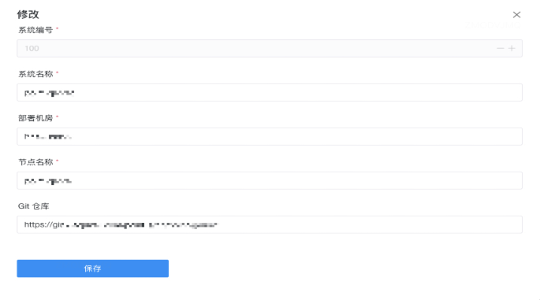
    

    <h3>图4.3 修改系统对话框</h3>
    
系统条目右侧的导出按钮并点击确认导出可以导出对应系统所有场景下的流程信息，并作为 zip 压缩包的形式下载到本地并用于对应的系统中。

    <h2>5. 场景管理</h2>

    <h3>5.1 场景列表</h3>
    
该列表页展示在当前平台注册的所有的场景信息，系统与场景属于一对多的关系。场景信息所含字段如下图所示。搜索栏中可通过输入“场景名称”或者“系统名称”来获取相应的场景信息。

    

        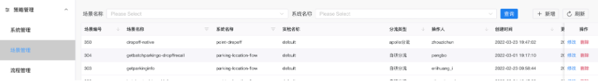
    

    <h3>5.2 场景配置</h3>
    
场景列表页存在四个可操作按钮：

    <ul>
        <li>新增：可手动添加某个系统下的场景信息；</li>
        <li>刷新：手动触发获取最新的场景列表；</li>
        <li>修改：针对单一场景修改其描述内容，除了场景编号之外其他内容均可修改；</li>
        <li>删除：删除某个场景；</li>
    </ul>

    <h2>6 工作流引擎代码接入</h2>
    <h3>6.1 代码框架</h3>
    
如下图为一个待接入工作流引擎的应用系统的项目代码，其中logic目录下为业务层代码，接入工作流引擎时，可以在业务层添加相关的接入代码，主要有：

    <ol>
        <li>工作流引擎初始化代码，类似下图中的workflow_task.go文件；</li>
        <li>工作流引擎调度执行代码，类似下图中的dispatcher_genrec.go；</li>
        <li>工作流节点对应的算子实现代码，算子有多个，可以放到不同子目录分组存放，类似下图中的module为上述子目录的父目录；</li>
        <li>算子注册代码，用于将算子注册到工作流引擎，类似下图中的module_init.go文件.</li>
    </ol>
    

        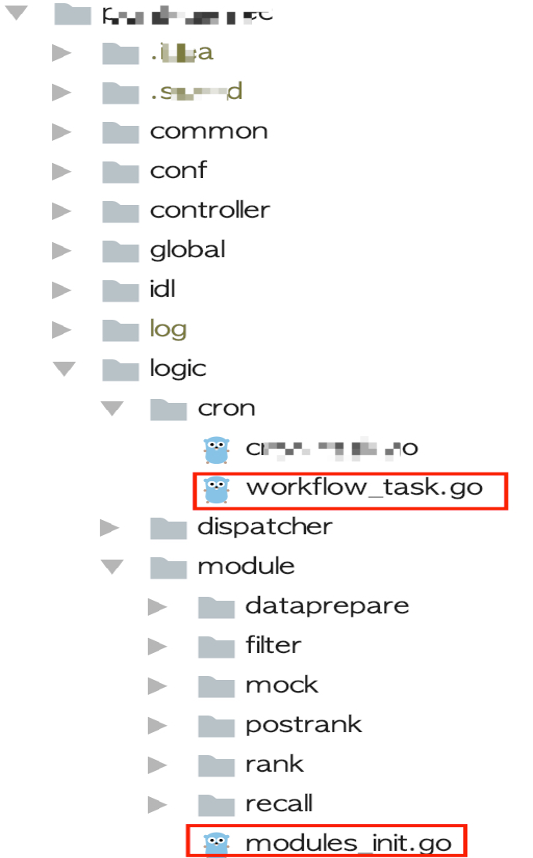
    

    <h3>6.2 工作流引擎初始化</h3>
    
我们提供了三种工作流引擎初始化的方式：从本地工作流配置文件初始化、从全局配置中心提取配置信息初始化，以及从redis提取配置信息初始化。下面介绍的是第一种，从本地文件初始化，可以在自己的系统初始化模块中调用（其中workflowPath为工作流配置文件根目录）：

    <pre>
<code>
func LoadWorkflowData(ctx context.Context) {
   moduleObj := module.ModuleObject{}
   workflowEngine, err := wfengine.NewWorkflowEngineFromFile(moduleObj, workflowPath)
   if err != nil {
      tlog.ErrorCount(ctx, "cron_task_workflow_err", fmt.Sprintf("workflow engine init fail, AppId=%v, error=%v", constants.CurrentAppId, err))
      return
   }

   global.WorkflowEngine = workflowEngine
   tlog.Handler.Infof(ctx, consts.DLTagCronTask, "workflow engine update successful, appId=%v, workflowEngine=%v", constants.CurrentAppId, global.WorkflowEngine)
}
</code>
</pre>

    <h3>6.3 工作流引擎调度执行</h3>
    
使用工作流引擎调度执行工作流，只需要在调度相关模块中添加下面的代码即可：

    <pre>
<code>
global.WorkflowEngine.Run(ctx, sc)
errMap := sc.GetErrorMap()
errMap.Range(func(key, val interface{}) bool {
   log.Println(fmt.Sprintf("workflowengine error, key=%v, val=%v", key, val))
)
   return true
})
</code>
</pre>

    <h3>6.4 工作流算子开发</h3>
    
通常一个应用系统中可能会有多个业务场景，每个场景下可能需要配置多个不同的工作流，应用系统对外提供服务时，需要根据实际业务场景或实验分组情况选择使用不同的工作流来执行，工作流则由若干个执行节点组成，每个执行节点对应的是一个算子，在golang语言中这些算子对应的是struct。我们需要在要接入tg-flow的应用系统中定义这些算子，下面为一个名为RecallSampAction的算子定义示例：

    <pre>
<code>
package recall

import (
   "context"
   "fmt"
   "github.com/didi/tg-flow/tg-core/model"
   "github.com/didi/tg-flow/tg-core/wfengine"
   "time"
)

type RecallSampAction struct {
   wfengine.ModelBase
}

func (r RecallSampAction) DoAction(ctx context.Context, sc *model.StrategyContext) interface{} {
   //此处添加相关业务逻辑
   return nil
}

func (r RecallSampAction) OnTimeout(context.Context, *model.StrategyContext){
   //此处添加超时处理逻辑
}
</code>
</pre>

    <h3>6.5 工作流算子注册</h3>
    
为了将开发好的算子注册给工作流引擎，需要进行算子注册，如下图中的case语句部分，即为工作流算子注册函数，我们只需要自己实现一个下面的函数，并在函数中的case语句中添加自己的实际开发的算子相关注册代码即可：

    <pre>
<code>
func (moduleObj ModuleObject) NewObj(moduleName string, vMap map[string]string) wfengine.IModelBase {
   switch moduleName {
       case “data.DataPrepareSamp1”: return &data.DataPrepareSamp1{}
       case “recall.RecallSamp1”: return &recall.RecallSamp1{}
       case “recall.RecallSamp2”: return &recall.RecallSamp2{}
   }
   return nil
}
</code>
</pre>

    <h3>6.6 代码仓库注册</h3>
    
在应用系统中完成上述代码编写后，可以将代码提交到git代码仓库，并将git仓库地址拷贝出来，然后进入系统管理页面，如下图所示，点击“修改”按钮，将该代码仓库的地址填写到弹出层中的“git仓库”文本框，如下图红色矩形框所示，然后点击“保存“按钮即可。

    

        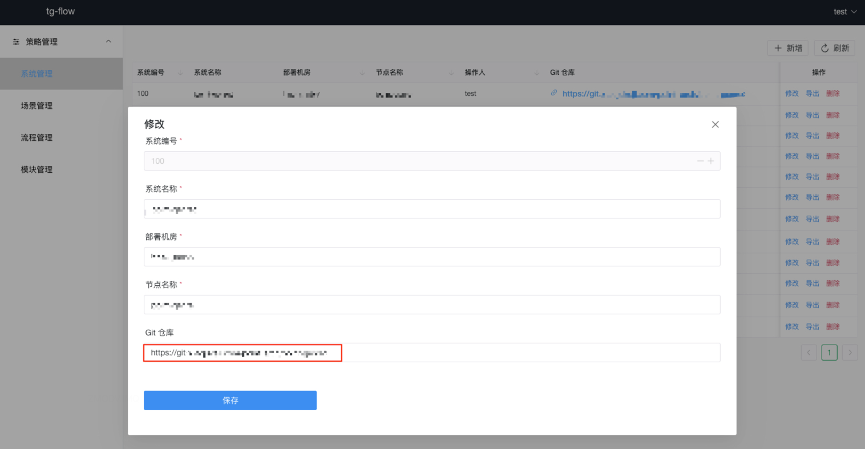
    

<h2>7 工作流管理</h2>
    <h3>7.1 工作流列表</h3>
    
点击左侧的“流程管理”目录，可以打开流程列表的管理页面，如下图所示。

    <!-- 插入流程列表管理页面的图片 -->
    

        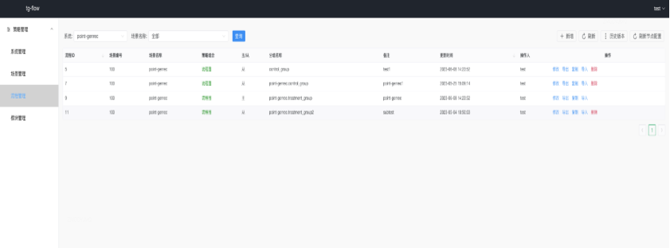
    

    <ol></ol>
    
选择列表上方的“系统”下拉框，点击查询，可以查到对应的应用系统已经添加的所有流程。

    
选择“场景名称”，点击查询，可以列出指定系统及场景下的所有工作流。

    
点击“新建”按钮，可以打开工作流编辑页面，开始一个新工作流的创建，下节会详细介绍新工作流的编辑功能。

    
工作流列表中有：修改、导出、复制、导入、删除等5个按钮。

    
点击“修改“按钮，可以打开工作流编辑页，后面的工作流编辑部分会详细介绍。

    
点击“导出”按钮，可以将当前工作流配置信息导出为一个json文件，点击确认后可以下载到本地，后面可以拷贝到待接入的应用系统工程目录下，应用系统在启动时，会初始化工作流引擎，工作流引擎初始化时可以通过本地方式加载上述配置。注意：此处是对单个工作流配置进行导出，如果要将某个系统下所有工作流打包导出，则需要进入到系统管理页操作。

    
点击“复制”按钮，可以新建一个同样的工作流配置，然后后面就可以在这个工作流上进行相关修改并保存。

    
点击“导入”按钮，会弹出一个对话框，这时可以将在外部编写的工作流配置信息复制并粘贴到这个对话框中的“导入内容（Json）”文本框中，点击“确认”按钮，即可完成工作流配置信息的导入，注意：工作流节点中的action_id的取值格式为：action-{场景ID}-{工作流ID}，导入工作流时如果相关actionId中的场景ID和工作流ID与当前要导入的场景ID和工作流ID不一致，系统会自动帮忙将actionId中的后面两部分的值调整为当前的场景ID和工作流ID。

    

        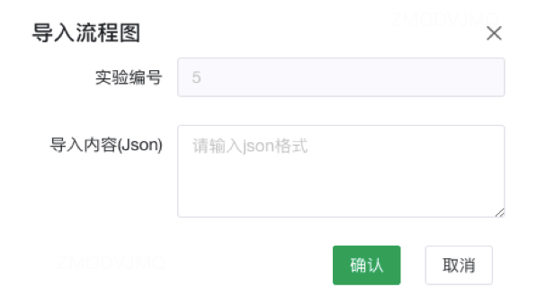
    

    <h3>7.2 工作流编辑</h3>
    
打开工作流编辑页，系统会自动读取前面配置好的git仓库中的代码模块，获取代码中的算子列表，并在工作流编辑页面的左侧算子列表中展示，供后续的工作流编辑用。(注意：工作流中的条件节点已经在工作流引擎中做了内置的模块实现，所以无需单独在应用层再做实现，当然如果有需要，也可以自定义条件节点后，注册到工作流引擎)。如下图，为工作流编辑页面。工作流编辑页面包括三个区域：左侧为工作流节点列表，中间为流程构建区域，右侧为工作流及节点属性编辑区域。

    

        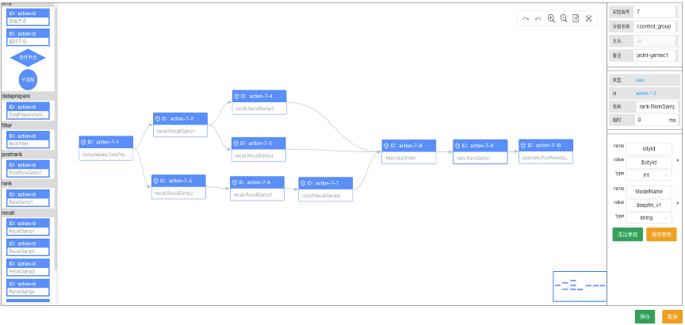
    

    
其中：

    
在后台管理系统中打开工作流编辑页面时，系统会从后台管理系统中配置的代码仓库中拉取代码模块名称，并以组件的方式显示在左侧组件栏。左侧的组件有两种类型：一是应用层节点，用户打开工作流图编辑界面后，会自动从对应的应用代码的git仓库中拉取对应的算子列表，展示在左侧的节点列表中。二是工作流引擎内置的条件节点和缺省节点（当git仓库未完成代码提交时，左侧无法拉取到代码模块名称，这时可以手动添加缺省节点，然后给缺省节点重新命名）。

    
从左侧组件栏中依次拖拽节点、添加节点之间的连线，可以逐步构建出类似下图中的主流程图和子流程图。

    
针对图中的每个节点，可以依次点击节点，然后在右侧的属性编辑区域编辑该节点的属性，如：节点名称、节点参数、节点描述信息等，完成所有节点属性的编辑后点击“保存”按钮，相关的工作流配置信息便会以json字符串格式存入数据库。

    

        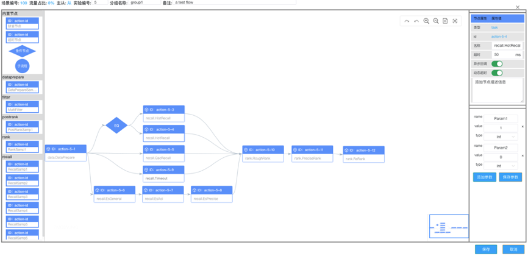
    

    <h3>7.3 工作流配置发布</h3>
    
上一节中已存入数据库的工作流配置信息并不能自动发布到在线应用系统，需要在系统管理页面中点击“提交”按钮，将上述配置发布到一个具有存储全局配置功能的存储服务中，一般可基于zookeeper或redis开发，以供应用系统从配置中心读取上述配置信息。相应地，我们在工作流引擎也提供了从redis、zookeeper及本地文件中加载工作流配置的方法，前面工作流引擎接入部分已有介绍不作详述。

    <!-- 更多内容 -->

    <h3>7.4 工作流导出与导入</h3>
    
然而，由于部分应用系统出于安全或者降低外部依赖的角度考虑，并不希望通过与后台管理系统进行联动的方式，动态更新工作流配置信息，因此我们在系统管理页面提供了工作流配置信息导出功能，用户可以直接将工作流配置信息导出为zip包，然后将上述zip包解压后直接添加到其应用系统的项目的本地目录下，应用系统在初始化工作流引擎时，可以直接使用工作流引擎提供的相关方法从本地目录加载工作流配置。

    <!-- 更多内容 -->
</main>
</body>
</html>